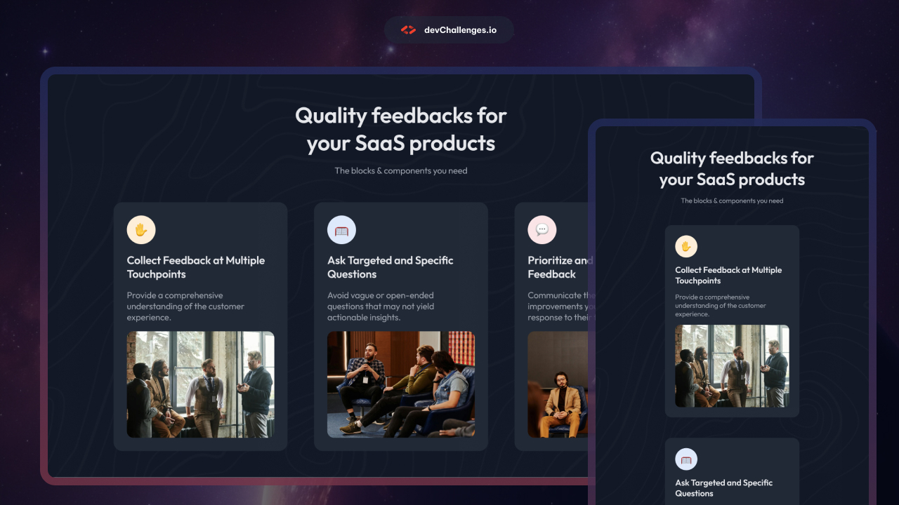

# DevChallenges.io - Simple Feature Section

## Welcome! 👋

Welcome to this responsive web coding challenge.

[devChallenges.io](https://devchallenges.io/) challenges are designed to help you enhance your coding skills by building realistic projects.

**Suggested Skills to practice: HTML and CSS**

## Table of Contents

- [Overview](#overview)
  - [What I learned](#what-i-learned)
  - [Useful resources](#useful-resources)
- [Built with](#built-with)
- [Features](#features)
- [Contact](#contact)
- [Acknowledgements](#acknowledgements)

<!-- OVERVIEW -->

## Overview

### What I learned

These types of projects help me learn about flexbox through hands on practice, very challenging but rewarding in the end!

### Built with

- Semantic HTML5 markup
- CSS custom properties
- Flexbox

## Features

This application/site was created as a submission to a [DevChallenges](https://devchallenges.io/challenge/simple-feature-section-challenge) challenge.

